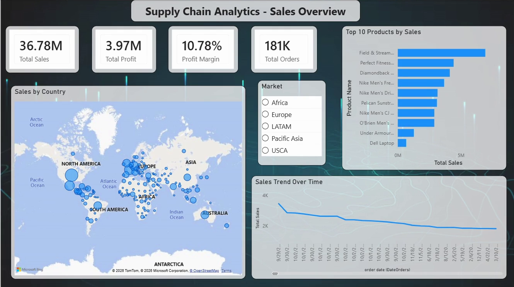
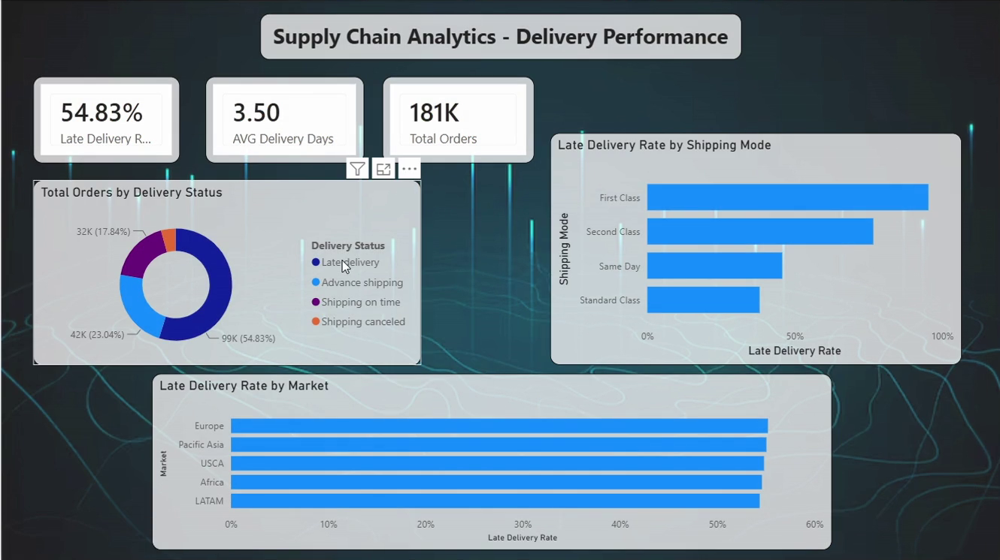
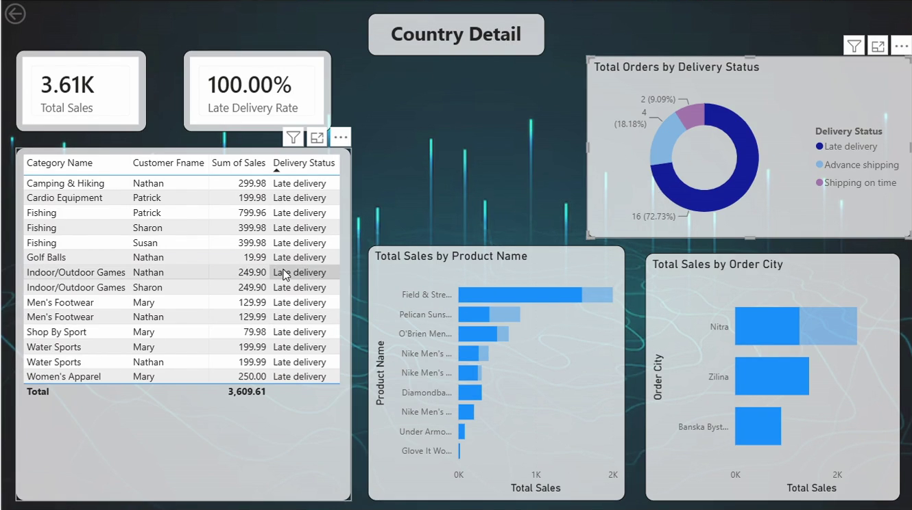

# SupplyChainAnalysis
Interactive Power BI dashboard analysing $36.78M in global supply chain sales and a 54.83% late delivery rate across 181K orders.


# Supply Chain Analytics — Power BI Dashboard

An interactive three-page Power BI report analysing **$36.78M in sales across 181K orders** from a global supply chain operation, built to answer two questions a supply chain manager actually cares about: *where is the money coming from*, and *why are half our shipments late?*

[▶️ Watch Dashboard Demo](demo/DashboardDemo.mp4)

---

## The problem

Most supply chain reporting stops at "here is revenue by region." That tells an operations team nothing actionable. This report connects the commercial view (sales, profit, margin) to the operational view (delivery status, shipping mode, lead time), so a late-delivery problem can be traced from a headline KPI down to the individual order.

## Headline findings

| Metric | Value |
|---|---|
| Total sales | $36.78M |
| Total profit | $3.97M |
| Profit margin | 10.78% |
| Total orders | 181K |
| **Late delivery rate** | **54.83%** |
| Average delivery days | 3.50 |

Three things stood out in the analysis:

**1. Lateness is a shipping-mode problem, not a geography problem.**
The late delivery rate barely moves between markets — Europe, Pacific Asia, USCA, Africa and LATAM all sit within one percentage point of each other (~54–55%). But by shipping mode the spread is enormous: **First Class is late roughly 95% of the time**, Second Class ~76%, while Standard Class is late ~38%. The premium service is the least reliable one, which points at scheduled lead times that are too aggressive rather than at any regional logistics failure.

**2. Only 17.8% of orders actually arrive on time as promised.**
Of 181K orders: 99K (54.83%) late, 42K (23.04%) advance shipping, 32K (17.84%) on time, and the remainder cancelled. Combined with point 1, "advance" and "late" are largely artefacts of how the scheduled shipping days are set per mode.

**3. Margin is thin and flat.**
A 10.78% profit margin holds steady across markets, so profitability is driven by volume and mix rather than by any regional pricing advantage. Sales trend is gently declining over the period covered.

---

## Report pages

### 1. Sales Overview
Commercial performance at a glance — KPI cards for sales, profit, margin and order count, a geographic bubble map of sales by country, top 10 products by revenue, and a sales trend line. A **Market slicer** (Africa / Europe / LATAM / Pacific Asia / USCA) re-scopes every visual on the page.



### 2. Delivery Performance
The operational view — late delivery rate, average delivery days and order volume, with a delivery-status breakdown and late-rate comparisons across shipping mode and market. This is the page that isolates the shipping-mode finding above.



### 3. Country Detail (drill-through)
A drill-through page reached by right-clicking any country on the map. It filters to that single country and exposes order-level detail: category, customer, sale value and delivery status, alongside product and order-city breakdowns. Clicking a slice of the delivery-status donut cross-filters the whole page — selecting *Late delivery* drops the view to a 100% late delivery rate and shows exactly which orders and cities are responsible.




---

## Techniques demonstrated

- **Star-schema data modelling** with a dedicated date table for time intelligence
- **DAX measures** for rate and ratio calculations (late delivery rate, profit margin, average delivery days) — see [`docs/measures.md`](docs/measures.md)
- **Drill-through pages** with a back button, passing country context from the overview map
- **Cross-filtering and slicer interactions** across all visuals on a page
- **Report design** — consistent dark theme, KPI card hierarchy, and a layout that reads left-to-right from summary to detail

## Tech stack

- Power BI Desktop (`.pbix`)
- Power Query (M) for data cleaning and shaping
- DAX for measures and calculated columns

## Data

The analysis uses the **DataCo Smart Supply Chain** dataset — roughly 180K order line items covering 2015–2018, with commercial fields (sales, profit, product, category), customer fields, and logistics fields (delivery status, real vs. scheduled shipping days, shipping mode, market, order city and country).

The raw file is not committed to this repository because of its size. See [`data/README.md`](data/README.md) for the download link and where to place it.

## Getting started

1. Clone the repository:
   ```bash
   git clone https://github.com/nvishnupriya99/supply-chain-analytics-powerbi.git
   ```
2. Download the dataset as described in [`data/README.md`](data/README.md) and place the CSV in the `data/` folder.
3. Open `report/Supply_Chain_Analytics.pbix` in [Power BI Desktop](https://powerbi.microsoft.com/desktop/) (free).
4. Go to **Home → Transform data → Data source settings** and repoint the source to your local copy of the CSV, then **Refresh**.

> No Power BI licence is required to open and explore the report locally.

## Repository structure

```
supply-chain-analytics-powerbi/
├── README.md
├── LICENSE
├── report/
│   └── Supply_Chain_Analytics.pbix     # the Power BI report
├── data/
│   └── README.md                       # dataset source and setup
├── docs/
│   ├── measures.md                     # DAX measure reference
│   └── screenshots/                    # report page images
└── demo/
    └── dashboard-demo.mp4              # walkthrough recording
```

## Possible extensions

- Add a scheduled-vs-actual lead time variance measure to quantify how badly each shipping mode's SLA is calibrated
- Build a late-delivery risk classifier on the order-level features and surface the score back into the report
- Add month-over-month and year-over-year time intelligence to the sales trend
- Publish to the Power BI Service with row-level security by market

## Author

**Vishnu Priya** — MSc Data Science, Berlin
[LinkedIn](www.linkedin.com/in/vishnupriyanagabhairava) · [GitHub](https://github.com/nvishnupriya99)
